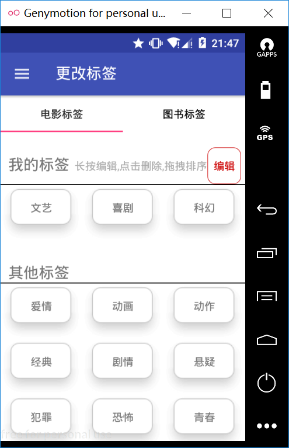

## 简豆
> 基于豆瓣Api的客户端，包含电影分类，图书分类，电影榜单，收藏功能，缓存功能，简易切换主题功能，每日图片功能。

## 特点
* 更小的APK : APK大小仅为2.72MB
* 贴近Google Material Design 设计规范

## 效果图

## 开源技术
1. [Picasso]
2. [JSoup]
3. [JsonObject]

## 声明
> 感谢[豆瓣API](https://developers.douban.com/wiki/?title=api_v2)提供的API接口，部分数据为Jsoup解析HTML获取，原作公司拥有所有权利。本程序仅供测试学习，用于其他用途所造成的纠纷与本人无关。部分图标资源来自网络，如有侵权请联系我删除。

>此程序为本人基于Material design的练习之作，其中还有很多不足与缺陷，如果遇到请联系本人邮箱或提交lssues

License
=======

    Copyright 2016 Maat

    Licensed under the Apache License, Version 2.0 (the "License");
    you may not use this file except in compliance with the License.
    You may obtain a copy of the License at

       http://www.apache.org/licenses/LICENSE-2.0

    Unless required by applicable law or agreed to in writing, software
    distributed under the License is distributed on an "AS IS" BASIS,
    WITHOUT WARRANTIES OR CONDITIONS OF ANY KIND, either express or implied.
    See the License for the specific language governing permissions and
    limitations under the License.

